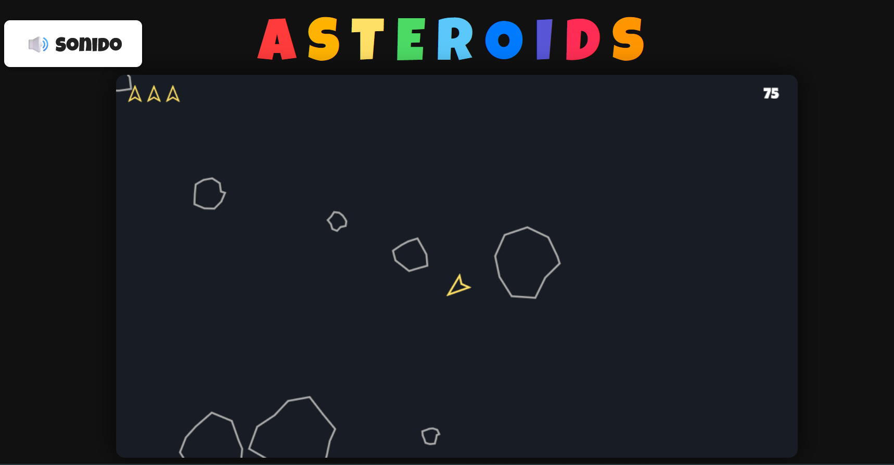

# Asteroids - Clon educativo

## Objetivo del juego

Controla una nave espacial y sobrevive el mayor tiempo posible destruyendo asteroides y esquivando sus fragmentos. ¡Evita colisionar y consigue la máxima puntuación!

## ¿Qué es un clon?

Un "clon" es una recreación de un juego clásico, en este caso el mítico **Asteroids** de los años 70, realizado desde cero con tecnologías modernas, respetando la jugabilidad y el espíritu del original.

## Propósito educativo

Este proyecto está diseñado como ejercicio práctico para un curso de programación dirigido a adolescentes y niños. Permite aprender conceptos de programación, gráficos, eventos, física básica y gestión de proyectos de software de forma divertida y visual.

## Estructura y descripción de los archivos

- **index.html**: Página principal y punto de entrada del juego. Incluye el canvas, los botones y enlaza todos los scripts.
- **gameManager.js**: Lógica principal del juego, bucle de juego, gestión de eventos y control de estados.
- **player.js**: Lógica y renderizado de la nave del jugador.
- **asteroid.js**: Lógica y renderizado de los asteroides, incluyendo su división en fragmentos.
- **bullet.js**: Lógica y renderizado de los disparos.
- **explosion.js**: Animaciones de explosión vectorial.
- **ui.js**: Interfaz de usuario, HUD, puntuación y vidas.
- **input.js**: Gestión de controles por teclado, ratón y touch.
- **utils.js**: Funciones utilitarias y matemáticas.
- **sound.js**: Gestión centralizada de los efectos de sonido.
- **explosion_asteroide.wav**: Sonido de explosión de asteroide.
- **explosion_ship.wav**: Sonido de explosión de la nave.
- **laserShoot.wav**: Sonido de disparo.
- **LiveUp.wav**: Sonido al ganar una vida extra.
- **NewLevel.wav**: Sonido al iniciar o pasar de nivel.
- **respawn.wav**: Sonido al reaparecer la nave.

## Dedicatoria

Con todo mi cariño para mis sobrinos: **Dani, Lucía, Rubén y Jorge**. ¡Que la programación os lleve tan lejos como vuestra imaginación!

---

## Captura de pantalla

[Ver el juego online en GitHub Pages](https://bartbender.github.io/Asteroids/)
